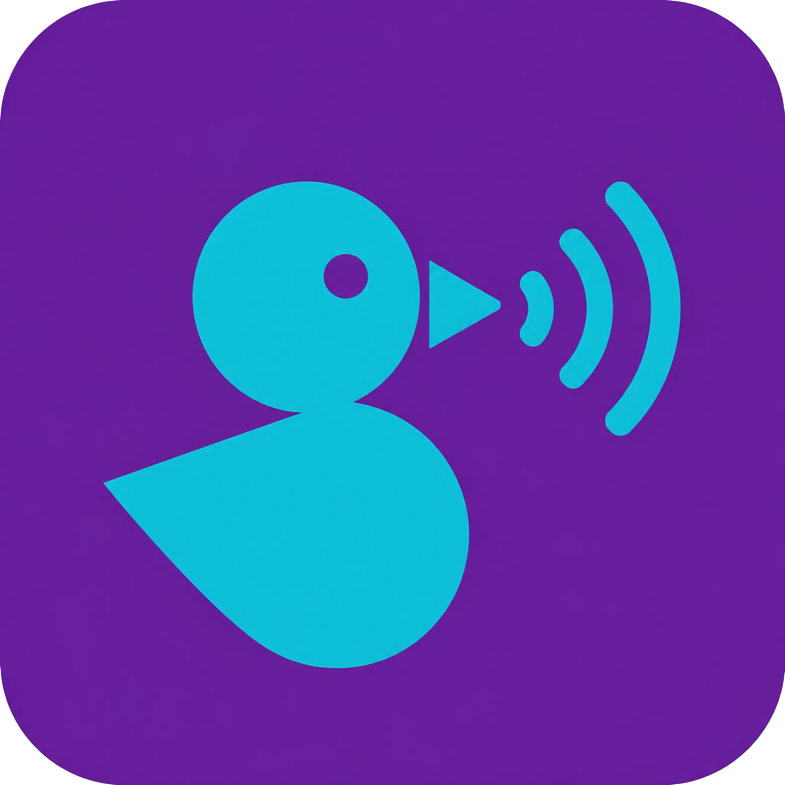

# Ducky

<p align="center">
  
</p>

Windows tray app that ducks, mutes, or pauses background audio when messaging apps play sustained audio (voice messages), while ignoring short notification sounds.

## Download

Pre-built Windows x64 binaries are on the [Releases](https://github.com/Dazaike/Ducky/releases) page.

| File | Description |
|------|-------------|
| `Ducky.exe` | Main tray app |
| `Ducky.Calibrate.exe` | Calibration tool for measuring notification durations |

No installer required — download, run, and use the system tray icon.

## Quick start

1. Run **Ducky.Calibrate.exe**, pick a target app, trigger notifications and voice messages, then export calibration.
2. Run **Ducky.exe**, play background music, and play a voice message — music should duck after your calibrated threshold.
3. Open **Settings** from the tray to switch between Mute, Duck (with fade), and Pause modes.

## Features

- **Calibration-first** — measure notification durations, then duck only on sustained playback
- **Multi-app profiles** — separate thresholds per messaging app
- **Smart gating** — only ducks when background audio is playing on your default output device (or a device you specify)
- **Three modes** — instant mute, smooth volume duck with configurable fade, or media-key pause
- **Low idle CPU** — event-driven session detection with polling fallback

## Modes

| Mode | Behavior |
|------|----------|
| **Mute** | Instantly mutes background audio |
| **Duck** | Fades volume down to duck ratio, fades back up on restore |
| **Pause** | Sends the system media play/pause key |

## Settings

Stored at `%AppData%\Ducky\settings.json` (tray → **Settings**).

| Setting | Default | Description |
|---------|---------|-------------|
| `durationThresholdMs` | from calibration | Min playback length before ducking |
| `duckingMode` | `Mute` | `Mute`, `Duck`, or `Pause` |
| `duckRatio` | `0.15` | Target volume when ducking |
| `duckFadeMs` | `300` | Fade duration for Duck mode (50–1500 ms) |
| `backgroundAudioDevicePattern` | *(empty)* | Comma-separated device name substrings; empty = Windows default output |
| `requireBackgroundAudio` | `true` | Only duck when something is playing on the background device |

## Build from source

**Requirements:** Windows 10/11, .NET 8 SDK

```powershell
git clone https://github.com/Dazaike/Ducky.git
cd Ducky
dotnet build Ducky.sln
```

### Run locally

```powershell
dotnet run --project src/Ducky/Ducky.csproj
dotnet run --project src/Ducky.Calibrate/Ducky.Calibrate.csproj
```

### Native AOT publish

```powershell
.\scripts\publish-aot.ps1
```

Output: `publish/Ducky/win-x64/Ducky.exe` and `publish/Ducky.Calibrate/win-x64/Ducky.Calibrate.exe`

## How it works

- Monitors target app audio sessions via WASAPI peak metering
- Uses **playback duration** to distinguish notification pings from voice messages
- Only ducks when background music is actively playing on the configured device
- Event-driven session detection with polling fallback

## Diagnostic logging

Tray → **Diagnostic logging** writes to `%AppData%\Ducky\ducky-trace.log`

## License

[MIT](LICENSE)
